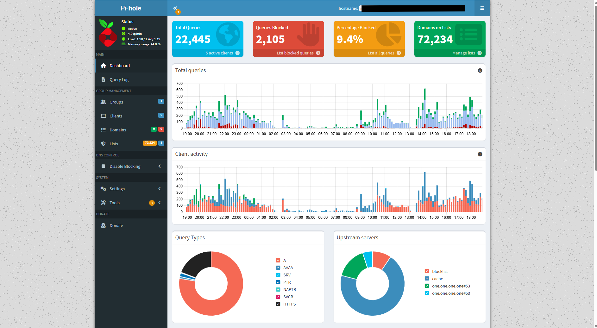
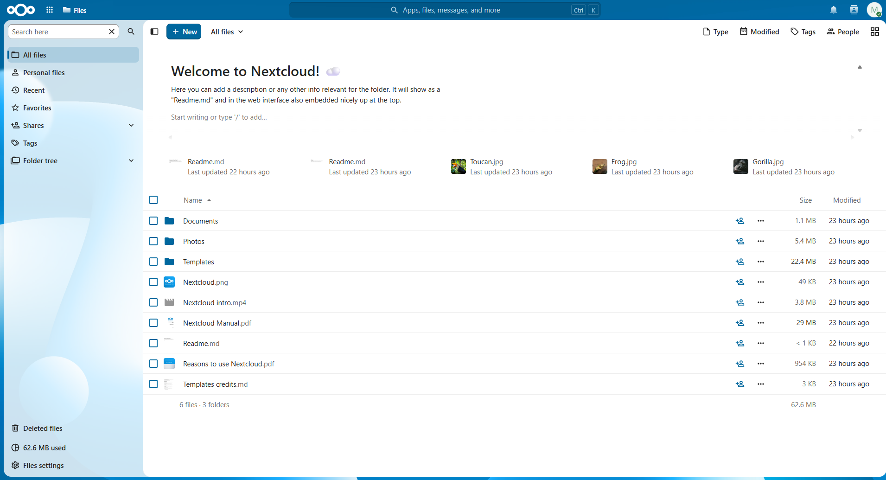

\# Ubuntu Home Server


A home server built from a repurposed HP Pavilion x360 laptop running Ubuntu Server services over a local Wi-Fi network.


The server provides network-wide DNS filtering with Pi-hole and private cloud storage with Nextcloud. Docker is used to isolate and manage the Nextcloud service.


\## Project Goals


\- Repurpose existing hardware as a home server

\- Block advertisements and tracking domains across the home network

\- Provide private file storage accessible from devices on the local network

\- Learn Linux server administration, networking, DNS, Docker, and service troubleshooting

\- Build a foundation for adding more self-hosted services later


\## Architecture


```mermaid

flowchart TD

&#x20;   Internet\["Internet"] --> Router\["Home Router"]

&#x20;   Router --> Clients\["Network Devices"]

&#x20;   Router --> Server\["Ubuntu Home Server"]


&#x20;   Clients -->|"DNS queries: port 53"| PiHole\["Pi-hole"]

&#x20;   PiHole -->|"Allowed DNS queries"| Internet


&#x20;   Clients -->|"Web access: port 8080"| Nextcloud\["Nextcloud"]

&#x20;   Server --> PiHole

&#x20;   Server --> Docker\["Docker Engine"]

&#x20;   Docker --> Nextcloud

```


\## Technology Stack


| Component | Purpose |

|---|---|

| Ubuntu 24.04.5 LTS | Host operating system |

| Pi-hole | Network-wide DNS filtering |

| Docker Engine | Container platform |

| Nextcloud | Private cloud storage |

| Git and GitHub | Project documentation and version control |


\## Hardware and Network


\- \*\*Device:\*\* HP Pavilion x360 laptop

\- \*\*Connection:\*\* Wi-Fi

\- \*\*Addressing:\*\* Static private IP address

\- \*\*Scope:\*\* Local home network

\- \*\*DNS configuration:\*\* The router distributes the Pi-hole server address to network clients


The real IP address, hostname, credentials, and other private network details are intentionally excluded from this repository.


\## Pi-hole


Pi-hole runs directly on the Ubuntu host and listens for DNS requests on port 53.


The home router is configured to provide the server's static IP address as the DNS server for network clients. This allows connected phones, computers, tablets, and other devices to benefit from DNS filtering without configuring every device separately.


Status can be checked on the server with:


```bash

sudo pihole status

```


The web dashboard is available inside the local network:


```text

http://<SERVER-IP>/admin

```


\## Docker


Docker Engine is installed as a system service. Its status can be checked with:


```bash

sudo systemctl status docker

```


Running containers can be viewed with:


```bash

docker ps

```


\## Nextcloud


Nextcloud runs inside a Docker container named `nextcloud`.


The container maps port `8080` on the Ubuntu host to port `80` inside the container:


```text

Host port 8080 → Container port 80

```


Nextcloud is accessible inside the local network at:


```text

http://<SERVER-IP>:8080

```


The container status can be checked with:


```bash

docker ps

```


\## Verification


The following checks were used to verify the installation:


```bash

sudo pihole status

sudo systemctl is-active docker

docker ps

```


Expected results:


\- Pi-hole DNS service is listening on port 53

\- Pi-hole blocking is enabled

\- Docker reports `active`

\- The Nextcloud container reports `Up`

\- The Pi-hole dashboard receives queries from network devices

\- Nextcloud is reachable from another device on the local network


## Screenshots

### Pi-hole Dashboard

The Pi-hole dashboard confirms that network devices are sending DNS requests through the server and that matching requests are being blocked.



### Nextcloud Files

The Nextcloud web interface is available to devices on the local network through the Docker container.




\## Security and Privacy


\- Administrative interfaces are intended for access from the local network

\- Strong passwords are used for the Pi-hole and Nextcloud administrator accounts

\- Credentials and private configuration files are excluded from version control

\- Real IP addresses, device names, DNS query history, and personal files are not published

\- The operating system and installed services are updated regularly


\## Repository Structure


```text

ubuntu-home-server/

├── config\_examples/   # Sanitized configuration examples

├── docs/              # Additional project documentation

├── screenshots/       # Screenshots with private details removed

└── README.md           # Project overview

```


\## Skills Required


\- Linux system administration

\- Static IP and local network configuration

\- DNS configuration and troubleshooting

\- Docker container management

\- Self-hosted service deployment

\- Firewall and service port configuration

\- Technical documentation

\- Git and GitHub


\## Possible Future Improvements


\- Configure HTTPS for Nextcloud

\- Add automated backups

\- Add container health monitoring

\- Deploy Home Assistant

\- Configure WireGuard for secure remote access

\- Add Docker Compose for reproducible container deployment

